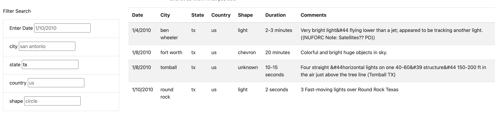

# UFOs

## Overview
Dana is a data journalist researching UFO sightings. The data presented here has been scraped and uploaded to present her findings to the wider public.

## Results
There are a plethora of UFO sightings across the United States, in virtually every state, with multiple events across the country per day. The data can be filtered by location and date, as well as the shape of the sighting, whether it be circles or triangles, etc. By typing in a criterion, the list automatically filters thanks to d3.

## Summary
There are some issues with the data that some cleaning could quickly fix, ex. some extra symbols in text like "Grants Pass&44 Oregon." That would make searching for the data potentially difficult, if users were able to search by text in the comments, which could be another functionality worth adding.
